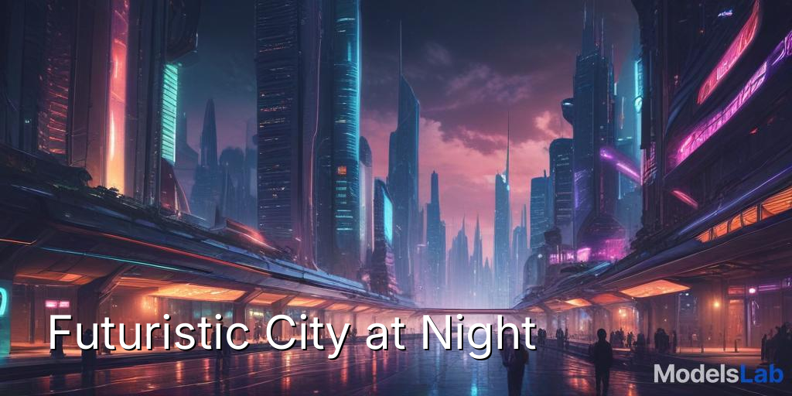
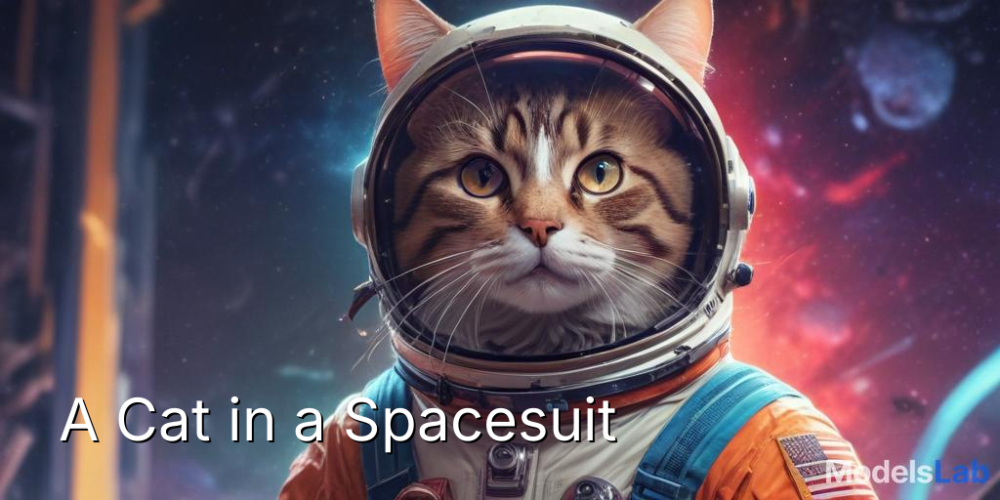

# AI Blog Thumbnail Creator (Full-Stack Application)

<div align="center">


</div>

This project is a full-stack web application that creates eye-catching blog thumbnails. A user can enter any blog title into the web interface, and the Python Flask backend uses the **Stability AI API** to generate a relevant background image and intelligently places the title text onto the image.

This tool was updated to a full-stack application with a frontend and backend to meet the mandatory resubmission requirements, demonstrating skills in web development, API integration, and professional software architecture.

---

## 📋 Table of Contents

- [Live Demo Gallery](#live-demo-gallery)
- [Technology Stack](#technology-stack)
- [How It Works](#how-it-works)
- [Key Features](#key-features)
- [Getting Started](#getting-started)
- [License](#license)
- [Contact](#contact)

---

## 🖼️ Live Demo Gallery

Here are a few sample thumbnails generated using the web application.

| Title: "Futuristic City at Night" | Title: "A Cat in a Spacesuit" |
| :----------------------------------------------------------: | :----------------------------------------------------------: |
|  |  |

---

## 🛠️ Technology Stack

-   **Backend:** **Flask** (Python Web Framework)
-   **Frontend:** HTML5, CSS3, Vanilla JavaScript
-   **Core Logic:** Python 3.8+
-   **AI Service:** **Stability AI API** (Stable Diffusion)
-   **Core Libraries:**
    -   `Pillow (PIL)` for image manipulation and text overlay.
    -   `Requests` for API communication.
    -   `python-dotenv` for secure management of API keys.

---

## ⚙️ How It Works

The system follows a full-stack pipeline:

1.  **User Input:** The user enters a title into the web interface (frontend).
2.  **API Request:** JavaScript sends the title to the Flask backend (`/generate` endpoint).
3.  **Smart Prompt Engineering:** The Flask backend takes the title and enriches it with contextual keywords to create a highly descriptive prompt for the AI.
4.  **AI Image Generation:** The engineered prompt is sent to the **Stability AI API** to generate a unique, widescreen background image.
5.  **Image Processing:** The backend uses the Pillow library to overlay the title, wrap text, and add a drop shadow for readability.
6.  **Response:** The final image is saved to the `static/output` folder, and the URL is sent back to the frontend, where it is displayed to the user.

---

## ✨ Key Features

-   **Interactive Web Interface:** A clean and user-friendly frontend for generating thumbnails on demand.
-   **Real-Time Feedback:** The UI provides a loading spinner while the backend works and displays the image instantly upon completion.
-   **Download Functionality:** Users can download the generated thumbnail directly from the browser.
-   **Context-Aware Prompts:** Enriches simple titles with keywords to generate more relevant and creative images.
-   **Robust Backend:** Built with Flask, with error handling and a secure API key setup.

---

## 🚀 Getting Started

To get a local copy up and running, follow these simple steps.

### Prerequisites

You will need Python 3.8+ and an active API Key from the **[Stability AI Platform](https://platform.stability.ai/)**.

### Installation & Setup

1.  **Clone the repository:**
    ```bash
    git clone https://github.com/CodeSmithAditya/AI-Thumbnail-Creator.git
    cd AI-Thumbnail-Creator
    ```

2.  **Create and activate a virtual environment:**
    ```bash
    # For Windows
    python -m venv venv
    .\venv\Scripts\activate
    ```

    ```bash
    # For macOS/Linux
    python3 -m venv venv
    source venv/bin/activate
    ```

3.  **Install the required libraries:**
    *(The `requirements.txt` file lists all necessary libraries for this project.)*
    ```bash
    pip install -r requirements.txt
    ```

4.  **Set up your API Key:**
    -   Create a file named `.env`.
    -   Add your API key to the file: `STABILITY_API_KEY="your_key_here"`

5.  **Run the Web Application:**
    ```bash
    python app.py
    ```

6.  **View the App:**
    -   Open your web browser and go to: **[http://127.0.0.1:5000](http://127.0.0.1:5000)**

---

## 📄 License

Distributed under the MIT License. See `LICENSE` for more information.

---

## 👤 Author

**Aditya Das**   
🔗 [LinkedIn](https://www.linkedin.com/in/adadityadas)  
🐙 [GitHub](https://github.com/CodeSmithAditya)  
📧 [adadityadas99@gmail.com](mailto:adadityadas99@gmail.com)

---