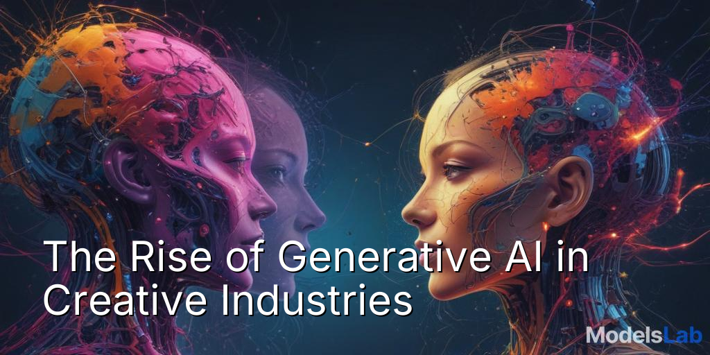
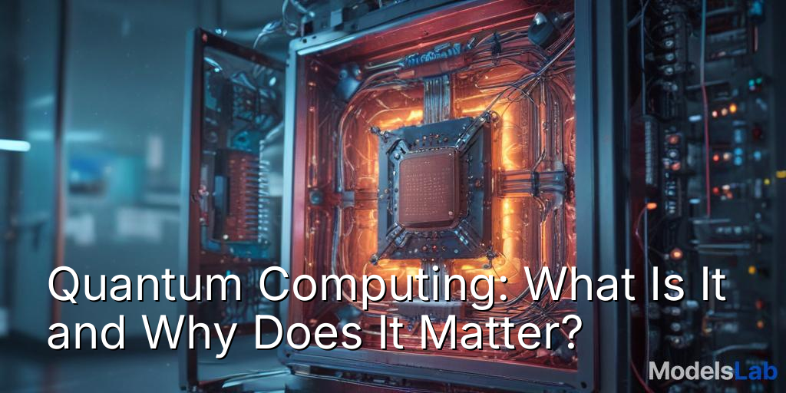

# AI Blog Thumbnail Creator

<div align="center">
  


</div>

This project is an automated Python system that creates eye-catching blog thumbnails. It takes a list of blog titles, uses the ModelsLab AI to generate a relevant background image, and intelligently places the title text onto the image. This tool was developed as part of a technical assignment to demonstrate skills in API integration, image processing, and automation.

---

## 📋 Table of Contents

- [How It Works](#how-it-works)
- [Generated Gallery](#generated-gallery)
- [Technology Stack](#technology-stack)
- [Key Features](#key-features)
- [Getting Started](#getting-started)
- [Configuration](#configuration)
- [License](#license)
- [Contact](#contact)

---

## ⚙️ How It Works

The system follows a 3-step automated pipeline:

1.  **Smart Prompt Engineering:** The script takes a blog title and enriches it with contextual keywords (e.g., adding "neural network, futuristic technology" for an AI-related title) to create a highly descriptive prompt.
2.  **AI Image Generation:** The engineered prompt is sent to the ModelsLab API, which uses a Stable Diffusion model to generate a unique, relevant background image from the text description.
3.  **Image Processing with Pillow:** The generated image is downloaded, and the original blog title is overlaid onto it. The script automatically wraps long titles and adds a drop shadow for maximum readability.

---

## 🖼️ Generated Gallery

Here are a few sample thumbnails generated by the script, showcasing its ability to match different topics.

| Title: "The Rise of Generative AI" | Title: "Quantum Computing: What Is It?" |
| :----------------------------------------------------------: | :----------------------------------------------------------: |
|  |  |

---

## 🛠️ Technology Stack

-   **Backend:** Python 3.8+
-   **AI Service:** ModelsLab API (Stable Diffusion)
-   **Core Libraries:**
    -   `Pillow (PIL)` for all image manipulation and text overlay.
    -   `Requests` for robust API communication.
    -   `python-dotenv` for secure management of API keys.

---

## ✨ Key Features

-   **Automated Pipeline:** Generates thumbnails from a simple list of titles with zero manual intervention.
-   **Context-Aware Prompts:** Enriches simple titles with keywords to generate more relevant and creative images.
-   **Batch Processing:** Can generate an entire content calendar's worth of thumbnails in a single run.
-   **Readability Focused:** Automatically wraps long titles and adds a drop shadow to ensure text is clear and legible.

---

## 🚀 Getting Started

To get a local copy up and running, follow these simple steps.

### Prerequisites

You will need Python 3.8+ and an active API Key from [ModelsLab](https://modelslab.com/) to use this script.

### Installation & Setup

1.  **Clone the repository:**
    ```bash
    git clone [https://github.com/CodeSmithAditya/AI-Thumbnail-Creator.git](https://github.com/CodeSmithAditya/AI-Thumbnail-Creator.git)
    cd AI-Thumbnail-Creator
    ```

2.  **Create and activate a virtual environment:**
    ```bash
    # For Windows
    python -m venv venv
    .\venv\Scripts\activate

    # For macOS/Linux
    python3 -m venv venv
    source venv/bin/activate
    ```

3.  **Create the `requirements.txt` file:**
    ```bash
    pip freeze > requirements.txt
    ```

4.  **Install the required libraries:**
    ```bash
    pip install -r requirements.txt
    ```

5.  **Set up your API Key:**
    -   Create a file named `.env`.
    -   Add your API key to the file: `MODELSLAB_API_KEY="your_key_here"`

6.  **Run the script:**
    ```bash
    python main.py
    ```
    The generated thumbnails will be saved in the `/output` folder.

---

## 🔧 Configuration

You can easily customize the generator by editing the following variables at the top of `main.py`:

-   `THUMBNAIL_WIDTH` / `THUMBNAIL_HEIGHT`: To change the image size.
-   `FONT_FILE` / `FONT_SIZE`: To change the font.
-   `blog_titles`: To provide your own list of titles for thumbnail generation.

---

## 📄 License

Distributed under the MIT License. See `LICENSE` for more information.

---

## 📬 Contact

Aditya Das - [LinkedIn](https://www.linkedin.com/adadityadas) - [Email](mailto:adadityadas99@gmail.com) - [GitHub](https://github.com/CodeSmithAditya)

Project Link: [https://github.com/CodeSmithAditya/AI-Thumbnail-Creator](https://github.com/CodeSmithAditya/AI-Thumbnail-Creator)